## Parte 1
Codigos usados:

1-
*use loja_virtual*

2-
*db.createCollection("produtos")*
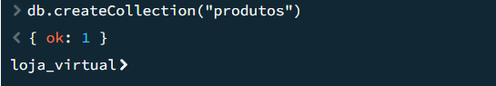

3-
 *db.produtos.insertOne({*
 *nome: "Smartphone Galaxy A15",*
 *categoria: "Eletronicos",*
 *preco: 1299.90,*
 *marca: "Samsung"})*
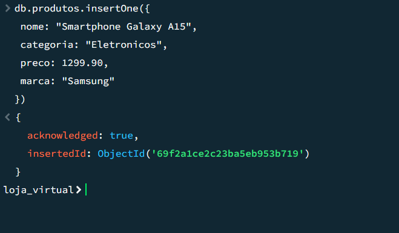

4-
*db.produtos.insertMany([{*
 *nome: "Camiseta Basica",*
 *categoria: "Roupas",*
 *preco: 49.90*
*},{*
 *nome: "Livro MongoDB",*
 *categoria: "Livros",*
 *preco: 79.90}])*
 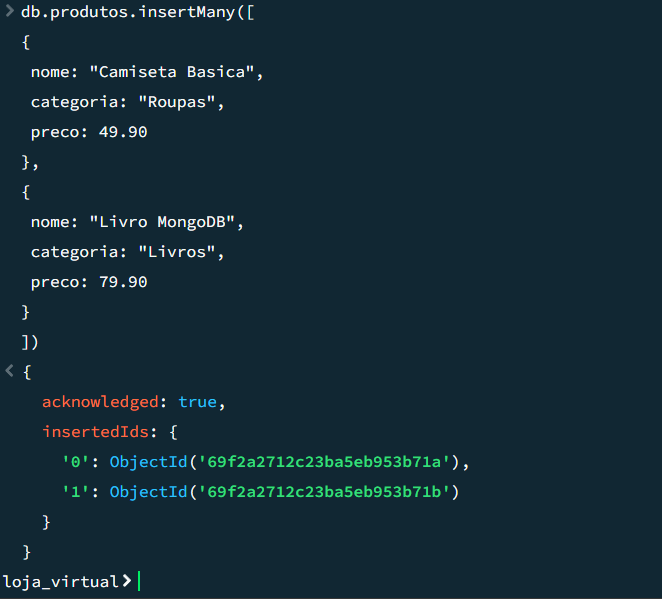

## Parte 2
Codigos usados:

1-
 *db.produtos.find()*
 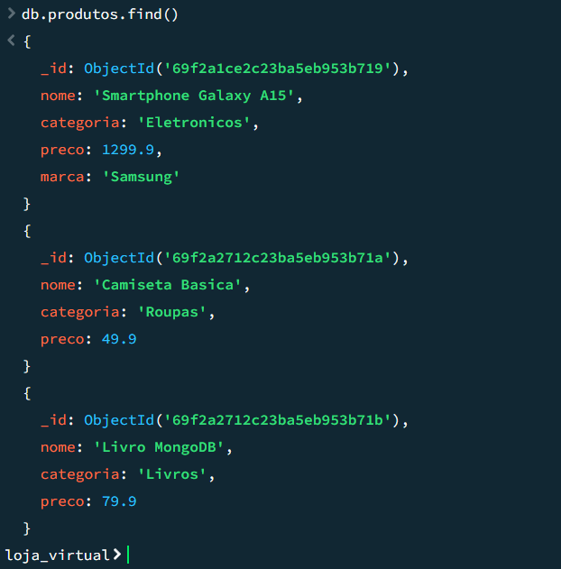

 2-
 *db.produtos.find({ preco: { $gt: 100 } })*
 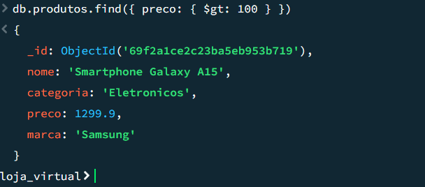

 3-
 *db.produtos.find({ categoria: "Eletronicos" })*
 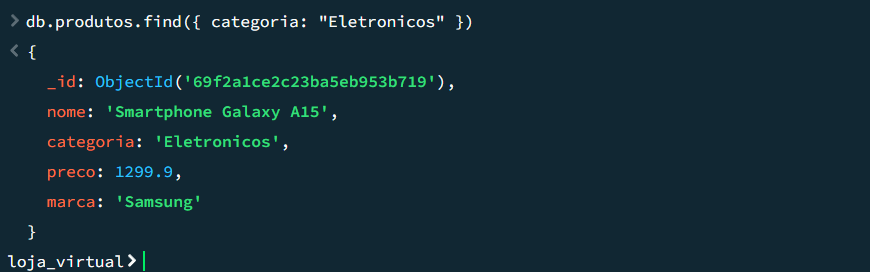

 4-
 *db.produtos.find({}, { nome: 1, preco: 1, _id: 0 })*
 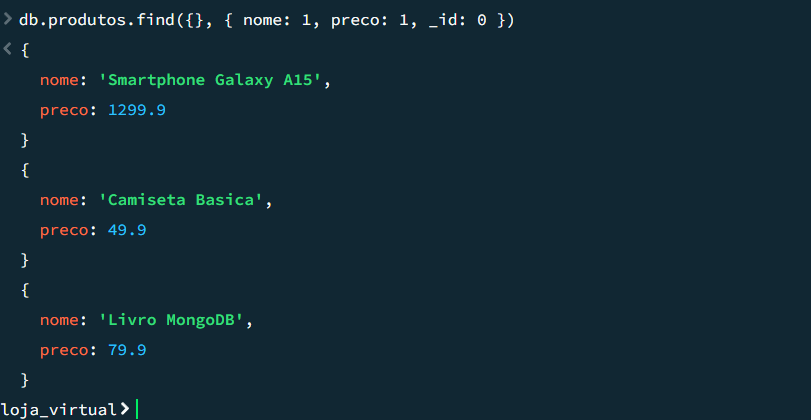

## Parte 3

 1-
 *db.produtos.updateOne(*
 *{ nome: "Camiseta Basica" },*
 *{ $set: { preco: 39.90 } })*
 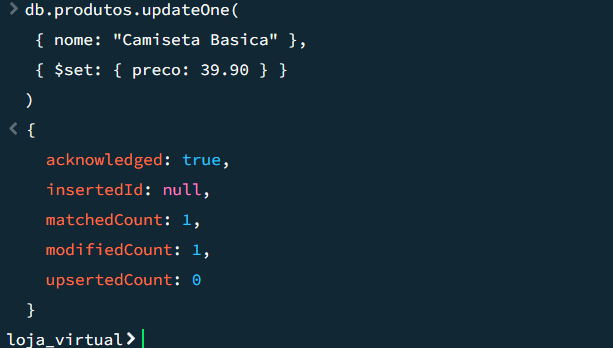

 2-
 *db.produtos.updateMany(*
 *{},*
 *{ $set: { estoque: 50 } })*
 

 3-
 *db.produtos.updateMany(*
* { categoria: "Roupas" },*
 *{ $set: { promocao: true } })*
 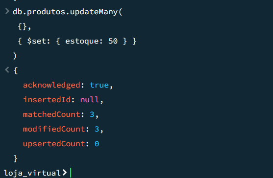

## Parte 4

 1-
 *db.produtos.deleteOne({ nome: "Livro MongoDB" })*
 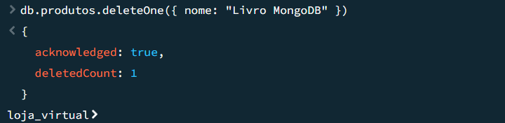

 2-
 *db.produtos.deleteMany({ categoria: "Roupas" })*
 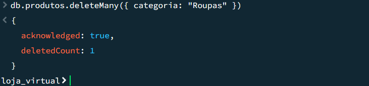